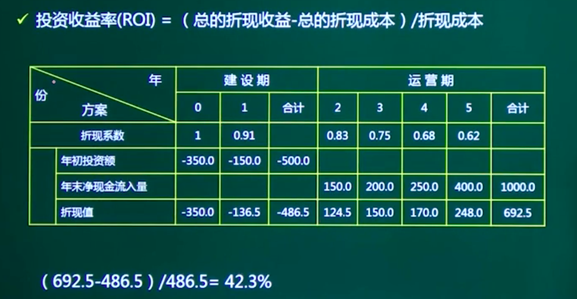

2-4分左右

<!-- more -->

# 1. 立项管理

### 1.1 项目建议书

项目建议书是项目发展周期的初始阶段,是国家或上级主管部门选择项目的 依据,也是可行性研究的依据,(在可行性研究之前)

涉及利用外资的项目,在项目建议书批准后,方 可开展对外工作。有些企业单位根据自身发展需要自行决定建设的项目,也参照 这一模式首先编制项目建议书

##### 核心内容

+ 项目的必要性
+ 项目的市场预测
+ 产品方案或服务的市场预测
+ 项目建设必需的条件

### 1.2 可行性研究

可行性研究内容包括:技术、组织、经济、财务、运行环境、法律、社会

+ 技术可行性分析:技术能力,产品功能,人力资源
+ 经济可行性分析:支出/收益分析,收益投资比,投资回收期, 感性分析
+ 运行环境可行性分析:考虑软件交付后,是否能顺利运行。 注:这涉及到用户单位的硬件平台,管理体制,人员素质,工作习惯等
+ 法律可行性分析 
+ 社会可行性分析 

初步可行性研究是在对市场或客户情况进行调查后,对项目进行初步评估

详细可行性研究需要对项目在技术、经济、社会、运行环境、法律等方面 进行深入调查研究

##### 1.2.1《可行性研究报告》内容

(1)项目概述(项目背景、可行性研究的结论)
(2)项目技术背景与发展概况
(3)现行系统业务、资源、设施情况分析
(4)项目技术方案
(5)实施进度计划
(6)投资估算与资金筹措计划
(7)人员及培训计划
(8)不确定性(风险)分析
(9)经济和社会效益预测与评价
(10)可行性研究结论与建议

##### 1.2.2 可行性研究-项目财务绩效评估方法

动态评价法(考虑货币时间价值)

+ 净现值
+ 内部收益率
+ 外部收益率
+ 动态投资回收期
+ 收益/成本比值

静态评价法(不考虑货币时间价值)

+ 投资收益率
+ 静态投资回收期

##### 1.2.3 投资回收期

投资回收期:收回全部投资所需要的年限 一般从**建设期**开始年份计算 

投资回收期的判别基准是**基准投资回收期**

投资回收期分:静态投资回收期和动态投资回收期。

##### 1.2.4 投资收益率(ROI)

##### 1.2.5 成本效益分析

区分1

+ 一次性成本:开发费、培训费、差旅费、设备购置费等
+ 非一次性成本:租金、人员工资福利、设施使用费,耗材等

区分2

+ 直接成本:直接用于项目组,项目经理可控。
+ 间接成本:分摊性质的成本。如房租。

**开发总成本(考点)**

+ 经营成本(**研发成本+行政管理费+销售与分销费用)**

+ 财务费用和折旧

收益

+ 直接收益:如销售项目产品的收入。
+ 间接收益:如成本的降低。

### 1.3 项目论证

先论证,后决策”是现代项目管理的基本原则。
项目论证应该围绕着**市场需求、开发技术、财务经济**三个方面展开调查和分析。

##### 1.3.1 项目论证的作用

+ 项目论证是确定项目是否实施的依据
+ 项目论证是筹措资金、向银行贷款的依据
+ 项目论证是编制计划、设计、采购、施工以及机构、设备、资源配置的依据
+ 项目论证是防范风险、提高项目效率的重要保证

##### 1.3.2 项目论证阶段划分

+ 机会研究阶段

+ 初步可行性研究阶段

+ 详细可行性研究阶段

##### 1.3.3 项目论证步骤

(1)明确项目范围和业主(建设单位)目标
(2)收集并分析相关资料
(3)拟定多种可行的能够相互替代的实施方案
(4)多方案分析、比较
(5)选择最优方案进一步详细全面地论证
(6)编制项目论证报告、环境影响报告书和采购方式审批报告
(7)编制资金筹措计划和项目实施进度计划

### 1.4 项目评估

> 例如银行评估你贷款

在项目可行性研究的基础上,由第三方对拟建项目进行评价、分析和论证,进而判断其是否可行(重点评估必要性)
审查项目可行性研究的可靠性、真实性和客观性

为银行的贷款决策或行政主管部门的审批决策提供科学依据

##### 1.4.1 评估依据

+ 项目建议书及其批准文件

+ 项目可行性研究报告

+ 报送单位的申请报告及主管部门的初审意见

+ 有关资源、配件、燃料、水、电、交通、通信、资金(包括外汇)等方面的协议文件

+ 必需的其他文件和资料

政府主管部门对某些大型信息化建设项目的项目建议书也要进行评估,其程序和内容与对项 目可行性研究的评估基本相同。